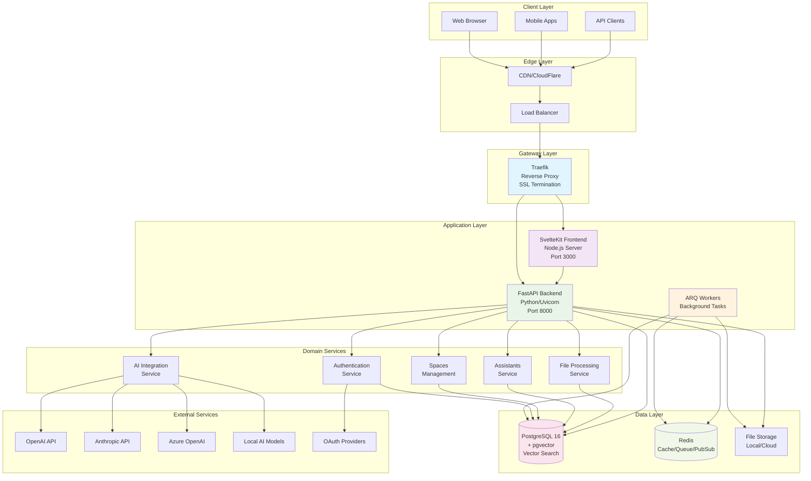
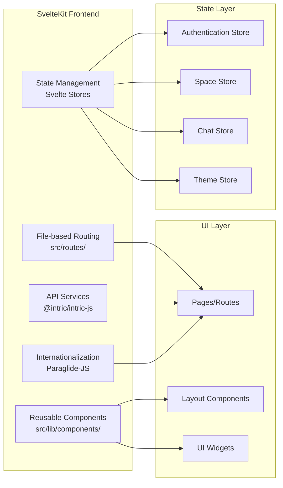
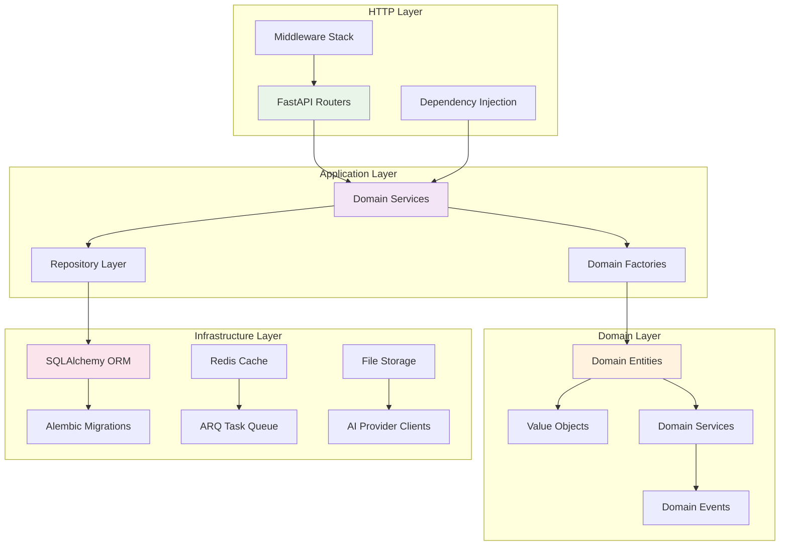
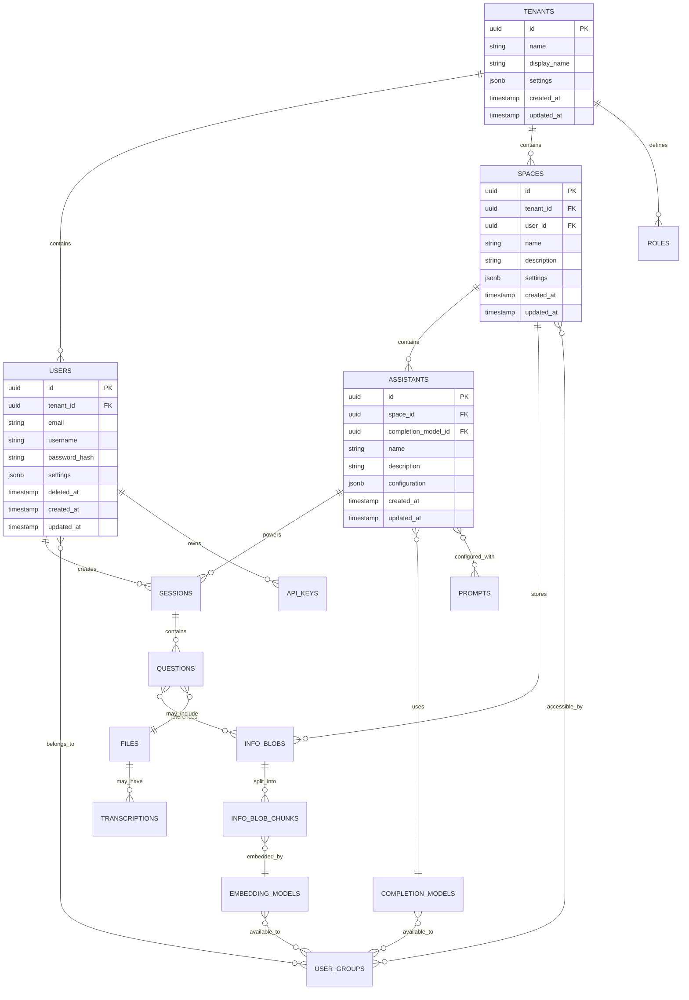
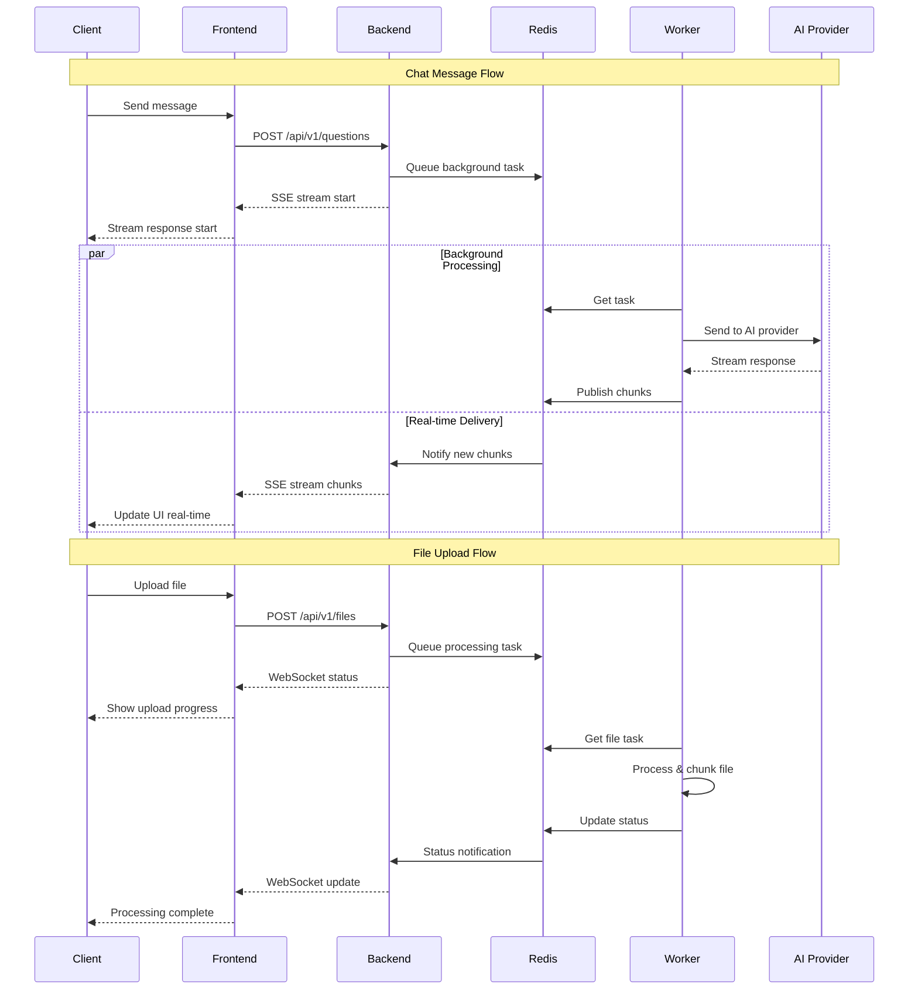
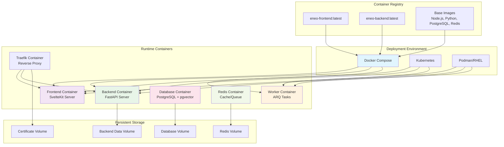

# Architecture Guide

This guide provides a comprehensive overview of Eneo's technical architecture, design patterns, and system components.

---

## 🏗️ System Overview

Eneo follows a **microservices architecture** with **domain-driven design** principles, built for scalability, maintainability, and democratic AI governance.

### Core Principles

- **🏛️ Domain-Driven Design**: Business logic organized by domain boundaries
- **🔄 Event-Driven Architecture**: Asynchronous processing via Redis pub/sub
- **🔌 API-First Design**: OpenAPI specification with auto-generated documentation
- **🎯 Multi-Tenancy**: Secure isolation between organizations
- **🚀 Real-Time Communication**: WebSockets and Server-Sent Events
- **🔒 Security by Design**: Built-in compliance and access control

---

## 🗄️ High-Level Architecture

<details>
<summary>🔍 Click to view complete system architecture</summary>



</details>

---

## 🏢 Domain-Driven Design Structure

Eneo implements DDD patterns with clear domain boundaries and consistent architectural patterns.

### Domain Organization

```
backend/src/intric/
├── assistants/           # AI Assistant Management Domain
├── spaces/              # Collaborative Workspaces Domain
├── users/               # User Management Domain
├── completion_models/   # AI Model Integration Domain
├── embedding_models/    # Vector Search Domain
├── files/               # Document Processing Domain
├── sessions/            # Conversation Management Domain
├── authentication/     # Security and Access Control Domain
├── groups_legacy/       # User Groups Domain (Legacy)
├── tenants/            # Multi-tenancy Domain
└── workflows/          # Business Process Automation Domain
```

### Domain Pattern Structure

Each domain follows a consistent layered architecture:

<details>
<summary>📁 Click to view domain structure pattern</summary>

```
domain_name/
├── api/                           # Presentation Layer
│   ├── domain_models.py          # Pydantic schemas for API
│   ├── domain_router.py          # FastAPI route definitions
│   └── domain_assembler.py       # Domain-to-API transformation
├── application/                   # Application Layer
│   └── domain_service.py         # Business logic and use cases
├── domain/                        # Domain Layer
│   ├── domain.py                 # Domain entities and value objects
│   └── domain_repo.py            # Repository interfaces
├── infrastructure/               # Infrastructure Layer
│   └── domain_repo_impl.py       # Repository implementations
├── domain_factory.py             # Domain object creation
└── __init__.py
```

**Layer Responsibilities:**
- **API Layer**: HTTP request/response handling, data validation
- **Application Layer**: Business use cases, orchestration
- **Domain Layer**: Core business logic, entities, rules
- **Infrastructure Layer**: Database access, external services

</details>

---

## 🖥️ Frontend Architecture

<details>
<summary>🔍 Click to view SvelteKit application structure</summary>



</details>

### Key Frontend Technologies

- **Framework**: SvelteKit with TypeScript
- **Package Manager**: pnpm with workspace support
- **UI Components**: Custom component library (@intric/ui)
- **Styling**: Tailwind CSS v4
- **API Client**: Type-safe client (@intric/intric-js)
- **State Management**: Svelte stores with reactive updates
- **Internationalization**: Paraglide-JS for Swedish/English
- **Build Tool**: Vite for development and production builds

---

## ⚙️ Backend Architecture

### FastAPI Application Structure

<details>
<summary>🔍 Click to view backend architecture diagram</summary>



</details>

### Core Backend Components

**Framework Stack:**
- **FastAPI**: Modern async web framework
- **SQLAlchemy**: ORM with async support
- **Alembic**: Database migration management
- **Pydantic**: Data validation and serialization
- **ARQ**: Async Redis Queue for background tasks

**Architecture Patterns:**
- **Repository Pattern**: Data access abstraction
- **Factory Pattern**: Complex object creation
- **Dependency Injection**: Service composition
- **Event Sourcing**: Domain event handling
- **CQRS**: Command Query Responsibility Segregation

---

## 💾 Data Architecture

### Database Design

<details>
<summary>🗄️ Click to view database schema overview</summary>



</details>

### Key Data Patterns

**Multi-tenancy:**
- All entities include `tenant_id` for data isolation
- Row-level security ensures tenant separation
- UUID primary keys prevent enumeration attacks

**Soft Deletes:**
- Users support soft deletion with `deleted_at` timestamp
- Maintains referential integrity while hiding deleted records

**Audit Trails:**
- All entities include `created_at` and `updated_at` timestamps
- Database triggers maintain accurate timestamps
- Comprehensive logging for compliance requirements

**Vector Storage:**
- PostgreSQL with pgvector extension for semantic search
- Embeddings stored alongside metadata in `info_blob_chunks`
- Efficient similarity search with indexing strategies

---

## 🔄 Real-Time Communication

### Communication Patterns

<details>
<summary>🔍 Click to view real-time architecture</summary>



</details>

### Real-Time Technologies

**Server-Sent Events (SSE):**
- Real-time AI response streaming
- Unidirectional server-to-client communication
- Automatic reconnection and error handling
- Browser-native support with EventSource API

**WebSockets:**
- Bidirectional real-time communication
- Background task status updates
- File upload progress tracking
- System-wide notifications

**Redis Pub/Sub:**
- Message broker for real-time events
- Scalable across multiple backend instances
- Event distribution to connected clients
- Persistent connection management

---

## 🔌 AI Integration

### Multi-Provider Architecture

Eneo supports multiple AI providers through a unified interface, allowing organizations to choose providers based on their needs, compliance requirements, and budget.

**Supported Providers:**
- **OpenAI**: GPT models for general-purpose AI
- **Anthropic**: Claude models for advanced reasoning
- **Azure OpenAI**: Enterprise-grade OpenAI models
- **Local Models**: Self-hosted models for data sovereignty

**Key Features:**
- **Provider Switching**: Change AI providers without code changes
- **Cost Optimization**: Automatic model selection based on cost/performance
- **Fallback Support**: Automatic failover if primary provider is unavailable
- **Usage Tracking**: Monitor costs and performance across providers

---

## 🏭 Background Processing

### ARQ Task System

Eneo uses ARQ (Async Redis Queue) for handling time-intensive operations that shouldn't block user interactions.

**Common Background Tasks:**
- **File Processing**: Document parsing, image analysis, audio transcription
- **AI Operations**: Embedding generation, batch completions
- **Web Crawling**: Website content extraction and indexing
- **Maintenance**: Database optimization, cache management

**Benefits:**
- **Non-blocking**: Users get immediate responses while processing happens in background
- **Scalable**: Add more worker containers as workload increases
- **Reliable**: Tasks are persisted in Redis and retried on failure
- **Prioritized**: Critical tasks processed before routine maintenance

---

## 🔒 Security

### Security by Design

Eneo implements security at every layer to protect sensitive public sector data and ensure compliance with European regulations.

**Authentication & Access Control:**
- **JWT Authentication**: Secure token-based sessions
- **Role-Based Access**: Granular permissions by user role
- **Multi-Tenancy**: Complete data isolation between organizations
- **API Keys**: Secure service-to-service authentication

**Data Protection:**
- **Encryption**: AES-256 for data at rest, TLS 1.3 in transit
- **Password Security**: Bcrypt hashing with secure salts
- **Audit Trails**: All actions logged for compliance
- **Data Retention**: Automatic deletion per policy

**Compliance Ready:**
- **GDPR**: Built-in data subject rights and privacy controls
- **EU AI Act**: Transparency and accountability features
- **Public Sector**: Designed for government security requirements

---

<details>
<summary>📊 Click to view monitoring and observability</summary>

## 📊 Monitoring and Observability

### Built-in Monitoring

Eneo includes comprehensive monitoring capabilities for production deployments.

**System Health:**
- Container resource usage and performance
- Database query performance and connection health
- Background task queue status and processing times
- API response times and error rates

**Business Intelligence:**
- User engagement and feature adoption
- AI model usage patterns and costs
- Document processing statistics
- Space collaboration metrics

**Security Monitoring:**
- Authentication failures and suspicious login attempts
- API rate limiting and abuse detection
- Data access patterns and compliance audits
- System resource anomalies

</details>

---

## 🚀 Deployment Architecture

### Container Architecture

<details>
<summary>📦 Click to view container deployment architecture</summary>



</details>

### Deployment Strategies

**Development:**
- Docker Compose for local development
- DevContainer for consistent development environment
- Hot reloading for rapid iteration
- Simplified networking and storage

**Production:**
- Multi-stage Docker builds for optimization
- Traefik for SSL termination and load balancing
- Persistent volumes for data storage
- Health checks and restart policies

**Enterprise:**
- Podman for RHEL/enterprise environments
- SystemD integration for service management
- Advanced monitoring and logging

---

## 📈 Scalability Considerations

### Horizontal Scaling

**Stateless Services:**
- Frontend and backend services designed as stateless
- Load balancing across multiple instances
- Session data stored in Redis for sharing
- Database connection pooling

**Background Processing:**
- ARQ workers can be scaled independently
- Queue-based task distribution
- Priority-based task processing
- Worker specialization by task type

**Database Scaling:**
- Read replicas for query scaling
- Connection pooling and optimization
- Vector index optimization for pgvector
- Partitioning strategies for large datasets

### Performance Optimization

**Caching Strategy:**
- Redis for session and application caching
- HTTP caching with appropriate headers
- Database query result caching
- Static asset caching via CDN

**AI Provider Optimization:**
- Request batching and queuing
- Response caching for similar queries
- Provider failover and retry logic
- Cost optimization through model selection

---

## 📚 Architecture Decision Records

### Key Architectural Decisions

**1. Domain-Driven Design Adoption**
- **Decision**: Organize code by business domains rather than technical layers
- **Rationale**: Better maintainability and team ownership
- **Trade-offs**: Increased complexity for simple features

**2. Multi-Provider AI Integration**
- **Decision**: Abstract AI providers behind unified interface
- **Rationale**: Vendor independence and flexibility
- **Trade-offs**: Additional complexity in provider-specific optimizations

**3. Real-Time Communication Strategy**
- **Decision**: Use SSE for streaming, WebSockets for bidirectional communication
- **Rationale**: Browser compatibility and simplicity
- **Trade-offs**: Separate connection management required

**4. Container-First Deployment**
- **Decision**: Docker/Podman as primary deployment method
- **Rationale**: Consistency across environments and simplified operations
- **Trade-offs**: Container orchestration complexity

---

This architecture supports Eneo's mission of democratic AI by providing a scalable, maintainable, and transparent platform that can grow with the needs of public sector organizations while maintaining the highest standards of security and compliance.