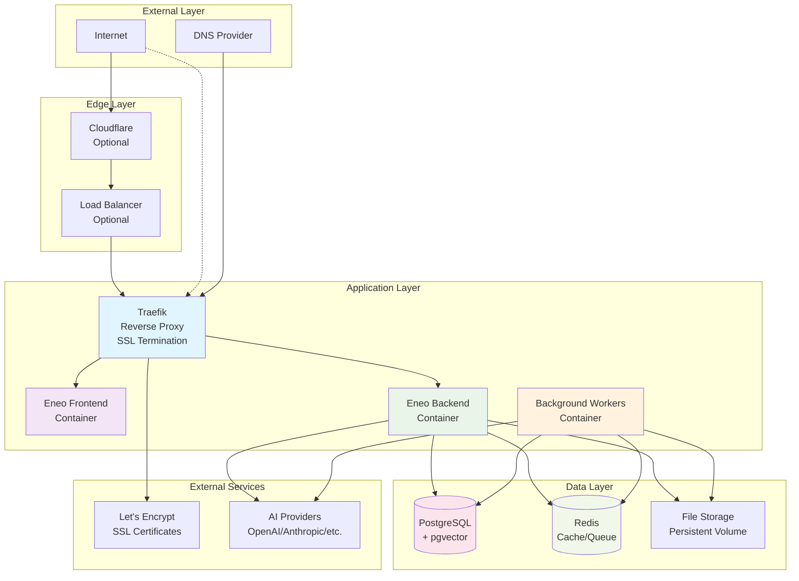

# Production Deployment Guide

This guide covers deploying Eneo in production environments. For development setup, see the [Installation Guide](INSTALLATION.md).

---

## 🎯 Deployment Overview

**Deployment Strategy:**
- **Container-based** deployment using Docker/Podman
- **Traefik** reverse proxy with automatic SSL certificates
- **PostgreSQL** with pgvector for vector search
- **Redis** for caching and task queuing
- **Background workers** for document processing

**Supported Environments:**
- Linux servers (Ubuntu, RHEL, CentOS)
- Cloud platforms (AWS, Azure, GCP)
- On-premises infrastructure
- Kubernetes clusters

---

## 🏗️ Production Architecture

<details>
<summary>🔍 Click to view production architecture diagram</summary>



</details>

---

## 📋 System Requirements

### Minimum Requirements
- **CPU**: 2 cores
- **RAM**: 4 GB
- **Storage**: 50 GB SSD
- **Network**: Outbound HTTPS for AI providers

### Recommended Requirements
- **CPU**: 4+ cores
- **RAM**: 8+ GB
- **Storage**: 100+ GB SSD
- **Network**: 1 Gbps connection

### Operating System Support
- **Ubuntu**: 20.04 LTS or higher
- **RHEL/CentOS**: 8 or higher
- **Debian**: 11 or higher
- **Container Runtime**: Docker 20.10+ or Podman 3.0+

---

## 🚀 Quick Production Deployment

### Prerequisites

```bash
# Install Docker and Docker Compose
curl -fsSL https://get.docker.com -o get-docker.sh
sh get-docker.sh

# Install Docker Compose (if not included)
sudo curl -L "https://github.com/docker/compose/releases/latest/download/docker-compose-$(uname -s)-$(uname -m)" -o /usr/local/bin/docker-compose
sudo chmod +x /usr/local/bin/docker-compose
```

### 1. Setup Deployment Directory

**Option A: Download deployment files only (Recommended)**

```bash
# Create deployment directory
sudo mkdir -p /opt/eneo/deployment
cd /opt/eneo/deployment

# Download deployment files
curl -o docker-compose.yml https://raw.githubusercontent.com/sundsvallai/eneo/main/docs/deployment/docker-compose.yml
curl -o env_backend.template https://raw.githubusercontent.com/sundsvallai/eneo/main/docs/deployment/env_backend.template
curl -o env_frontend.template https://raw.githubusercontent.com/sundsvallai/eneo/main/docs/deployment/env_frontend.template
curl -o env_db.template https://raw.githubusercontent.com/sundsvallai/eneo/main/docs/deployment/env_db.template
```

**Option B: Clone full repository (for customization)**

```bash
# Create deployment directory
sudo mkdir -p /opt/eneo
cd /opt/eneo

# Clone repository for access to source code and templates
git clone https://github.com/sundsvallai/eneo.git .
cd docs/deployment
```

### 2. Configure Environment

```bash
# Copy environment templates
cp env_backend.template env_backend.env
cp env_frontend.template env_frontend.env
cp env_db.template env_db.env

# Generate secure secrets
BACKEND_JWT_SECRET=$(openssl rand -hex 32)
FRONTEND_JWT_SECRET=$BACKEND_JWT_SECRET
DB_PASSWORD=$(openssl rand -base64 32)

# Edit environment files
nano env_backend.env  # Add AI API keys and secrets
nano env_frontend.env # Configure domain and secrets
nano env_db.env       # Set database password
```

> ⚠️ **Critical Security Steps**:
> - **JWT_SECRET**: Must be unique and match in both backend and frontend
> - **Database Password**: Use a strong, unique password
> - **API Keys**: Keep secure and never commit to version control
> - **Default Credentials**: Change immediately after first login

### 3. Update Docker Compose Configuration

Edit `docker-compose.yml` to configure your domain and email:

```bash
# Edit docker-compose.yml
nano docker-compose.yml

# Find and replace these values (marked with "CHANGE THIS"):
# 1. your-email@domain.com → your actual email (for SSL certificates)
# 2. your-domain.com → your actual domain (appears 4 times)
```

### 4. Deploy

```bash
# Create external network
docker network create proxy_tier

# Start services
docker compose up -d

# Check status
docker compose ps
docker compose logs -f
```

---

## ⚙️ Environment Configuration

### Minimal Configuration Example

Here's a minimal working configuration. For all available options, see the template files.

**Backend (`env_backend.env`):**
```bash
# Required: Add at least one AI provider
OPENAI_API_KEY=sk-proj-your-actual-key

# Required: Security (generate with: openssl rand -hex 32)
JWT_SECRET=your-generated-64-character-hex-secret
URL_SIGNING_KEY=your-generated-64-character-hex-secret

# Database (defaults for Docker Compose)
POSTGRES_HOST=db
POSTGRES_PASSWORD=your-secure-password

# Everything else uses secure defaults from the template
```

**Frontend (`env_frontend.env`):**
```bash
# Required: Your domain
ORIGIN=https://your-domain.com
INTRIC_BACKEND_URL=https://your-domain.com

# Required: Must match backend JWT_SECRET exactly
JWT_SECRET=your-generated-64-character-hex-secret

# Defaults are fine for everything else
```

**Database (`env_db.env`):**
```bash
POSTGRES_PASSWORD=your-secure-password
# Other values use secure defaults
```

---

## 🔒 Security Configuration

### SSL Certificates

Traefik automatically manages SSL certificates via Let's Encrypt:

1. **Automatic Renewal**: Certificates auto-renew before expiration
2. **Multiple Domains**: Support for multiple domains and subdomains
3. **Security Headers**: HSTS and security headers automatically added

### Firewall Configuration

```bash
# Ubuntu/Debian with ufw
sudo ufw allow 22/tcp    # SSH
sudo ufw allow 80/tcp    # HTTP (redirects to HTTPS)
sudo ufw allow 443/tcp   # HTTPS
sudo ufw enable

# RHEL/CentOS with firewalld
sudo firewall-cmd --permanent --add-service=ssh
sudo firewall-cmd --permanent --add-service=http
sudo firewall-cmd --permanent --add-service=https
sudo firewall-cmd --reload
```

### Docker Security

```bash
# Create non-root user for Docker
sudo groupadd docker
sudo usermod -aG docker $USER

# Secure Docker daemon
sudo systemctl enable docker
sudo systemctl start docker

# Regular security updates
sudo apt update && sudo apt upgrade -y  # Ubuntu/Debian
sudo dnf update -y                      # RHEL/CentOS
```

---

## 📊 Monitoring and Maintenance

### Health Checks

```bash
# Check service status
docker compose ps

# View logs
docker compose logs -f backend
docker compose logs -f frontend
docker compose logs -f worker

# Resource usage
docker stats

# Database health
docker compose exec db pg_isready -U postgres
```

### Backup Strategy

<details>
<summary>💾 Database Backup</summary>

```bash
# Create backup script
cat > /opt/eneo/backup.sh << 'EOF'
#!/bin/bash
BACKUP_DIR="/opt/eneo/backups"
DATE=$(date +%Y%m%d_%H%M%S)
mkdir -p $BACKUP_DIR

# Database backup
docker compose exec -T db pg_dump -U postgres eneo > $BACKUP_DIR/eneo_db_$DATE.sql

# Backend data backup
docker run --rm -v eneo_eneo_backend_data:/data -v $BACKUP_DIR:/backup alpine tar czf /backup/eneo_data_$DATE.tar.gz -C /data .

# Keep only last 30 days
find $BACKUP_DIR -name "*.sql" -mtime +30 -delete
find $BACKUP_DIR -name "*.tar.gz" -mtime +30 -delete

echo "Backup completed: $DATE"
EOF

chmod +x /opt/eneo/backup.sh

# Add to crontab for daily backups
(crontab -l ; echo "0 2 * * * /opt/eneo/backup.sh") | crontab -
```

</details>

### Updates and Maintenance

```bash
# Update containers
docker compose pull
docker compose up -d

# Clean up old images
docker system prune -f

# Database maintenance
docker compose exec db vacuumdb -U postgres -d eneo --analyze

# Check disk usage
df -h
docker system df
```

---

## 🏢 Enterprise Deployment

### RHEL/CentOS with Podman

<details>
<summary>🔴 RHEL Enterprise Setup</summary>

```bash
# Install Podman and dependencies
sudo dnf install -y podman podman-compose podman-docker
sudo systemctl enable podman.socket

# Configure SELinux (if enabled)
sudo setsebool -P container_manage_cgroup on
sudo setsebool -P container_use_cgroup_namespace on

# Setup Eneo
sudo mkdir -p /opt/eneo
cd /opt/eneo
# ... copy configuration files ...

# Use podman-compose instead of docker-compose
podman-compose up -d

# Create systemd service
sudo cat > /etc/systemd/system/eneo.service << 'EOF'
[Unit]
Description=Eneo AI Platform
After=network.target

[Service]
Type=oneshot
RemainAfterExit=true
WorkingDirectory=/opt/eneo/deployment
ExecStart=/usr/bin/podman-compose up -d
ExecStop=/usr/bin/podman-compose down
TimeoutStartSec=0

[Install]
WantedBy=multi-user.target
EOF

sudo systemctl enable eneo
sudo systemctl start eneo
```

</details>

### Kubernetes Deployment

<details>
<summary>☸️ Kubernetes Configuration</summary>

```yaml
# namespace.yaml
apiVersion: v1
kind: Namespace
metadata:
  name: eneo

---
# configmap.yaml
apiVersion: v1
kind: ConfigMap
metadata:
  name: eneo-config
  namespace: eneo
data:
  POSTGRES_HOST: "eneo-postgresql"
  REDIS_HOST: "eneo-redis"
  # ... other non-secret config

---
# secret.yaml
apiVersion: v1
kind: Secret
metadata:
  name: eneo-secrets
  namespace: eneo
type: Opaque
stringData:
  JWT_SECRET: "your-jwt-secret"
  POSTGRES_PASSWORD: "your-db-password"
  OPENAI_API_KEY: "your-openai-key"
  # ... other secrets

---
# deployment.yaml
apiVersion: apps/v1
kind: Deployment
metadata:
  name: eneo-backend
  namespace: eneo
spec:
  replicas: 2
  selector:
    matchLabels:
      app: eneo-backend
  template:
    metadata:
      labels:
        app: eneo-backend
    spec:
      containers:
      - name: backend
        image: ghcr.io/sundsvallai/eneo-backend:latest
        ports:
        - containerPort: 8000
        envFrom:
        - configMapRef:
            name: eneo-config
        - secretRef:
            name: eneo-secrets
        volumeMounts:
        - name: data
          mountPath: /app/data
      volumes:
      - name: data
        persistentVolumeClaim:
          claimName: eneo-backend-pvc

# ... additional resources for frontend, worker, database, etc.
```

</details>

---

## 🔧 Troubleshooting

### Common Issues

<details>
<summary>🚨 SSL Certificate Issues</summary>

**Problem**: SSL certificate not working

**Solutions**:
```bash
# Check Traefik logs
docker compose logs traefik

# Verify domain DNS
nslookup your-domain.com

# Check Let's Encrypt rate limits
# Wait if rate limited, or use staging environment

# Force certificate renewal
docker compose restart traefik
```

</details>

<details>
<summary>🐳 Container Issues</summary>

**Problem**: Containers not starting

**Solutions**:
```bash
# Check container logs
docker compose logs

# Check resource usage
docker stats
df -h

# Restart services
docker compose restart
docker compose up -d --force-recreate
```

</details>

<details>
<summary>🗄️ Database Issues</summary>

**Problem**: Database connection errors

**Solutions**:
```bash
# Check database container
docker compose logs db

# Test database connection
docker compose exec db pg_isready -U postgres

# Check database initialization
docker compose logs db-init

# Manual database init
docker compose exec backend python init_db.py
```

</details>

---

## 📚 Production Checklist

### Pre-deployment
- [ ] Domain name configured and DNS pointing to server
- [ ] SSL email configured for Let's Encrypt
- [ ] All environment variables configured
- [ ] AI provider API keys tested
- [ ] Secure passwords generated for database and JWT
- [ ] Firewall configured
- [ ] Backup strategy implemented

### Post-deployment
- [ ] All services running (`docker compose ps`)
- [ ] HTTPS working with valid certificate
- [ ] Default user password changed
- [ ] Admin user created
- [ ] First AI assistant tested
- [ ] Monitoring configured
- [ ] Backup tested and verified

### Ongoing Maintenance
- [ ] Regular container updates
- [ ] Database backups verified
- [ ] Security updates applied
- [ ] Log monitoring configured
- [ ] Performance monitoring setup

---

## 📞 Support

**Production Issues:**
- 🔍 Check [Troubleshooting Guide](TROUBLESHOOTING.md)
- 🐛 [Report Issues](https://github.com/sundsvallai/eneo/issues)
- 📧 [Enterprise Support](mailto:digitalisering@sundsvall.se)

**Community Support:**
- 💬 [GitHub Discussions](https://github.com/sundsvallai/eneo/discussions)
- 📖 [Documentation](README.md)
- 🤝 [Contributing Guide](CONTRIBUTING.md)