```mermaid
graph TB
    subgraph "External Layer"
        USER[Users/Clients]
        ATTACK[Potential Threats]
    end
    
    subgraph "Perimeter Security"
        WAF[Web Application Firewall]
        RATE[Rate Limiting]
        DDoS[DDoS Protection]
    end
    
    subgraph "Application Layer"
        AUTH[Authentication Layer]
        AUTHZ[Authorization Layer]
        INPUT[Input Validation]
        OUTPUT[Output Sanitization]
    end
    
    subgraph "API Layer"
        JWT[JWT Token Validation]
        CORS[CORS Protection]
        CSRF[CSRF Protection]
        API_KEY[API Key Validation]
    end
    
    subgraph "Business Logic"
        RBAC[Role-Based Access Control]
        TENANT[Multi-Tenant Isolation]
        AUDIT[Audit Logging]
        PRIVACY[Privacy Controls]
    end
    
    subgraph "Data Layer"
        ENCRYPT[Data Encryption]
        BACKUP[Secure Backups]
        RETENTION[Data Retention]
        MASKING[Data Masking]
    end
    
    subgraph "Infrastructure"
        TLS[TLS Termination]
        SECRETS[Secret Management]
        MONITOR[Security Monitoring]
        UPDATES[Security Updates]
    end
    
    USER --> WAF
    ATTACK -.->|Blocked| WAF
    WAF --> RATE
    RATE --> DDoS
    DDoS --> AUTH
    
    AUTH --> AUTHZ
    AUTHZ --> INPUT
    INPUT --> OUTPUT
    
    OUTPUT --> JWT
    JWT --> CORS
    CORS --> CSRF
    CSRF --> API_KEY
    
    API_KEY --> RBAC
    RBAC --> TENANT
    TENANT --> AUDIT
    AUDIT --> PRIVACY
    
    PRIVACY --> ENCRYPT
    ENCRYPT --> BACKUP
    BACKUP --> RETENTION
    RETENTION --> MASKING
    
    MASKING --> TLS
    TLS --> SECRETS
    SECRETS --> MONITOR
    MONITOR --> UPDATES
    
    style AUTH fill:#fce4ec
    style RBAC fill:#e8f5e8
    style ENCRYPT fill:#fff3e0
    style TLS fill:#e1f5fe
```

# Security Policy

Eneo takes security seriously as a platform designed for public sector organizations handling sensitive data. This document outlines our security practices, vulnerability reporting process, and security guidelines.

---

## 🛡️ Security Philosophy

**Security by Design**: Eneo implements security controls at every layer, from the database to the user interface.

**Compliance First**: Built with GDPR and EU AI Act compliance requirements in mind.

**Transparency**: Open source security allows for community review and verification.

**Defense in Depth**: Multiple layers of security controls protect against various threat vectors.

---

## 🔒 Security Features

### Authentication & Authorization

**Multi-layer Authentication**:
- JWT-based session management with secure token handling
- Bcrypt password hashing with configurable complexity
- API key authentication for service integrations
- Optional OIDC/SSO integration for enterprise environments

**Granular Authorization**:
- Role-based access control (RBAC) with fine-grained permissions
- Multi-tenant data isolation with row-level security
- Space-based access controls for collaborative features
- API endpoint authorization checks

**Security Headers**:
```
X-Content-Type-Options: nosniff
X-Frame-Options: DENY
X-XSS-Protection: 1; mode=block
Strict-Transport-Security: max-age=31536000; includeSubDomains
Content-Security-Policy: default-src 'self'
```

### Data Protection

**Encryption**:
- **At Rest**: AES-256 encryption for sensitive data fields
- **In Transit**: TLS 1.3 for all HTTP communications
- **Database**: PostgreSQL transparent data encryption support
- **Secrets**: Environment-based secret management

**Data Handling**:
- PII detection and masking in logs
- Secure file upload validation and processing
- Automatic data retention policy enforcement
- Audit trails for all data access and modifications

### Infrastructure Security

**Container Security**:
- Non-root container execution where possible
- Minimal base images with regular security updates
- Secret management through environment variables
- Network isolation between services

**Network Security**:
- Default deny firewall rules
- Service-to-service communication over internal networks
- Rate limiting and DDoS protection
- Automated SSL certificate management

---

## 🔍 Security Architecture

<details>
<summary>🏗️ Click to view security architecture diagram</summary>



</details>

---

## 🚨 Vulnerability Reporting

### Security Issues

**For security vulnerabilities, please follow responsible disclosure**:

1. **Do NOT create public GitHub issues for security vulnerabilities**
2. **Email security reports to**: security@sundsvall.se
3. **Include detailed information** (see template below)
4. **Allow reasonable time** for investigation and fix
5. **Coordinate disclosure** timing with maintainers

### Vulnerability Report Template

```
Subject: [SECURITY] Vulnerability in Eneo - [Brief Description]

## Vulnerability Details
- **Component**: [Backend/Frontend/Database/Infrastructure]
- **Severity**: [Critical/High/Medium/Low]
- **Attack Vector**: [Remote/Local/Physical]
- **Authentication Required**: [Yes/No]

## Description
[Detailed description of the vulnerability]

## Reproduction Steps
1. [Step 1]
2. [Step 2]
3. [Step 3]

## Impact
[Potential impact and affected systems]

## Suggested Remediation
[Your suggestions for fixing the issue]

## Proof of Concept
[Screenshots, logs, or code demonstrating the issue]

## Reporter Information
- Name: [Your name]
- Organization: [If applicable]
- Contact: [Email address]
```

### Response Process

**Timeline**:
- **24 hours**: Initial acknowledgment
- **72 hours**: Initial assessment and severity classification
- **30 days**: Target resolution for high/critical issues
- **90 days**: Target resolution for medium/low issues

**Communication**:
- Regular updates on investigation progress
- Coordination on disclosure timeline
- Credit for responsible disclosure (if desired)

---

## 🔐 Security Guidelines for Developers

### Secure Coding Practices

**Input Validation**:
```python
# Always validate and sanitize input
from pydantic import BaseModel, Field, validator

class CreateAssistantRequest(BaseModel):
    name: str = Field(..., min_length=1, max_length=100, regex=r'^[a-zA-Z0-9\s\-_]+$')
    description: str = Field(..., max_length=500)
    
    @validator('name')
    def validate_name(cls, v):
        # Additional validation logic
        if not v.strip():
            raise ValueError('Name cannot be empty')
        return v.strip()
```

**SQL Injection Prevention**:
```python
# Use SQLAlchemy ORM or parameterized queries
from sqlalchemy import text

# Good - parameterized query
result = session.execute(
    text("SELECT * FROM users WHERE email = :email"),
    {"email": user_email}
)

# Bad - string concatenation
# result = session.execute(f"SELECT * FROM users WHERE email = '{user_email}'")
```

**XSS Prevention**:
```typescript
// Frontend - always escape user content
import { escape } from 'html-escaper';

function displayUserContent(content: string): string {
    return escape(content);
}

// Svelte - use {@html} carefully
<!-- Good -->
<p>{userContent}</p>

<!-- Be careful with this -->
<!-- {@html sanitizedContent} -->
```

**Authentication Checks**:
```python
# Always verify authentication and authorization
@router.get("/assistants/{assistant_id}")
async def get_assistant(
    assistant_id: UUID,
    current_user: User = Depends(get_current_user),  # Required auth
    service: AssistantService = Depends()
) -> AssistantResponse:
    # Verify user has access to this specific assistant
    assistant = await service.get_assistant_with_permission_check(
        assistant_id, 
        current_user
    )
    return AssistantResponse.from_domain(assistant)
```

### Security Checklist for Pull Requests

**Before submitting a PR, verify**:

- [ ] All user inputs are validated and sanitized
- [ ] Authentication is required for protected endpoints
- [ ] Authorization checks are implemented for data access
- [ ] No sensitive data (passwords, API keys) in logs
- [ ] SQL injection protection through ORM or parameterized queries
- [ ] XSS protection through proper output encoding
- [ ] CSRF tokens for state-changing operations
- [ ] Secure error handling that doesn't leak sensitive information
- [ ] Rate limiting for API endpoints
- [ ] Proper session management and token handling

---

## 🏢 Enterprise Security

### Compliance Features

**GDPR Compliance**:
- Data subject rights implementation (access, rectification, erasure)
- Consent management for data processing
- Data portability features
- Privacy by design architecture
- Audit trails for all data processing activities

**EU AI Act Readiness**:
- Transparency requirements for AI system operation
- Risk assessment and mitigation documentation
- Human oversight capabilities
- Accuracy and robustness monitoring
- Audit trail generation for AI decisions

### Security Configuration

**Production Security Settings**:
```bash
# Backend environment variables
JWT_EXPIRY_TIME=3600                    # 1 hour token expiry
UPLOAD_MAX_FILE_SIZE=10485760           # 10MB upload limit
LOGLEVEL=INFO                           # Avoid DEBUG in production
USING_ACCESS_MANAGEMENT=True            # Enable access controls

# Security headers
SECURE_SSL_REDIRECT=True
SECURE_HSTS_SECONDS=31536000
SECURE_HSTS_INCLUDE_SUBDOMAINS=True
SECURE_CONTENT_TYPE_NOSNIFF=True
SECURE_BROWSER_XSS_FILTER=True
```

**Database Security**:
```sql
-- Enable row-level security
ALTER TABLE assistants ENABLE ROW LEVEL SECURITY;
ALTER TABLE spaces ENABLE ROW LEVEL SECURITY;
ALTER TABLE sessions ENABLE ROW LEVEL SECURITY;

-- Create security policies
CREATE POLICY tenant_isolation_assistants ON assistants
    FOR ALL TO authenticated_users
    USING (tenant_id = current_setting('app.current_tenant_id')::uuid);
```

**Network Security**:
```yaml
# Docker Compose security
services:
  backend:
    security_opt:
      - no-new-privileges:true
    read_only: true
    tmpfs:
      - /tmp:noexec,nosuid,size=100m
```

---

## 🔍 Security Monitoring

### Audit Logging

**Logged Events**:
- Authentication attempts (success/failure)
- Authorization failures
- Data access and modifications
- Administrative actions
- System configuration changes
- File uploads and processing
- AI model interactions

**Log Format**:
```json
{
  "timestamp": "2024-01-15T10:30:00Z",
  "event_type": "authentication_success",
  "user_id": "uuid",
  "tenant_id": "uuid", 
  "ip_address": "192.168.1.100",
  "user_agent": "Mozilla/5.0...",
  "details": {
    "method": "jwt_token",
    "session_id": "uuid"
  }
}
```

### Security Monitoring

**Metrics to Monitor**:
- Failed authentication attempts
- Permission denied errors
- Unusual access patterns
- Large file uploads
- High API usage
- Database query performance

**Alerting Thresholds**:
```bash
# Example alert conditions
- Failed logins > 10 per minute from same IP
- Permission errors > 50 per hour
- File uploads > 100MB
- API requests > 1000 per minute per user
- Database connections > 80% of limit
```

---

## 🛠️ Security Tools and Testing

### Static Analysis

**Backend Security Scanning**:
```bash
# Install security tools
pip install bandit safety

# Run security scans
bandit -r src/
safety check

# Check for known vulnerabilities
poetry audit
```

**Frontend Security Scanning**:
```bash
# Install security tools
pnpm add -D eslint-plugin-security

# Run security linting
pnpm audit
pnpm run lint:security
```

### Dynamic Testing

**API Security Testing**:
```bash
# Test authentication
curl -H "Authorization: Bearer invalid-token" \
     http://localhost:8000/api/v1/assistants

# Test input validation
curl -X POST http://localhost:8000/api/v1/assistants \
     -H "Content-Type: application/json" \
     -d '{"name": "<script>alert(1)</script>"}'

# Test rate limiting
for i in {1..100}; do
    curl http://localhost:8000/api/v1/assistants &
done
```

### Penetration Testing

**Regular Security Assessment**:
- Quarterly vulnerability scans
- Annual penetration testing
- Code security reviews for major releases
- Infrastructure security assessments

---

## 📚 Security Resources

### Training and Awareness

**For Developers**:
- OWASP Top 10 awareness
- Secure coding practices training
- Regular security updates and briefings
- Code review security checklist

**For Administrators**:
- Infrastructure security best practices
- Incident response procedures
- Security monitoring and alerting
- Backup and recovery procedures

### Security Standards

**Compliance Frameworks**:
- ISO 27001 information security management
- GDPR data protection requirements
- EU AI Act compliance guidelines
- NIST Cybersecurity Framework

### External Resources

- [OWASP Application Security](https://owasp.org/)
- [NIST Cybersecurity Framework](https://www.nist.gov/cyberframework)
- [SANS Security Resources](https://www.sans.org/)
- [CVE Database](https://cve.mitre.org/)

---

## 🚨 Incident Response

### Security Incident Categories

**Severity Levels**:
- **Critical**: Active exploitation, data breach, system compromise
- **High**: Potential for exploitation, privilege escalation
- **Medium**: Security weakness requiring attention
- **Low**: Minor security improvements

### Response Process

**Immediate Response**:
1. **Assess and contain** the threat
2. **Notify stakeholders** according to severity
3. **Document** all actions taken
4. **Preserve evidence** for investigation
5. **Implement temporary mitigations**

**Investigation**:
1. **Analyze** the security incident
2. **Determine scope** and impact
3. **Identify root cause**
4. **Develop permanent fix**
5. **Update security controls**

**Recovery**:
1. **Implement fixes** and patches
2. **Restore services** if needed
3. **Verify** system integrity
4. **Update documentation**
5. **Conduct post-incident review**

### Contact Information

**Security Team**: security@sundsvall.se
**Emergency Contact**: digitalisering@sundsvall.se
**Business Hours**: Monday-Friday, 08:00-17:00 CET

---

## 📋 Security Compliance

### Regular Security Tasks

**Monthly**:
- Review access logs and permissions
- Update dependencies and security patches
- Scan for vulnerabilities
- Review user accounts and remove unused ones

**Quarterly**:
- Security assessment and testing
- Review and update security policies
- Backup testing and verification
- Security training updates

**Annually**:
- Comprehensive security audit
- Penetration testing
- Business continuity planning review
- Security incident response testing

### Compliance Documentation

- Security risk assessments
- Data processing impact assessments
- Security control implementation guides
- Incident response procedures
- Business continuity plans

---

**Security is everyone's responsibility**. By following these guidelines and reporting security issues responsibly, we can maintain Eneo as a secure platform for democratic AI in the public sector.

For questions about security practices or to report security issues, contact: security@sundsvall.se