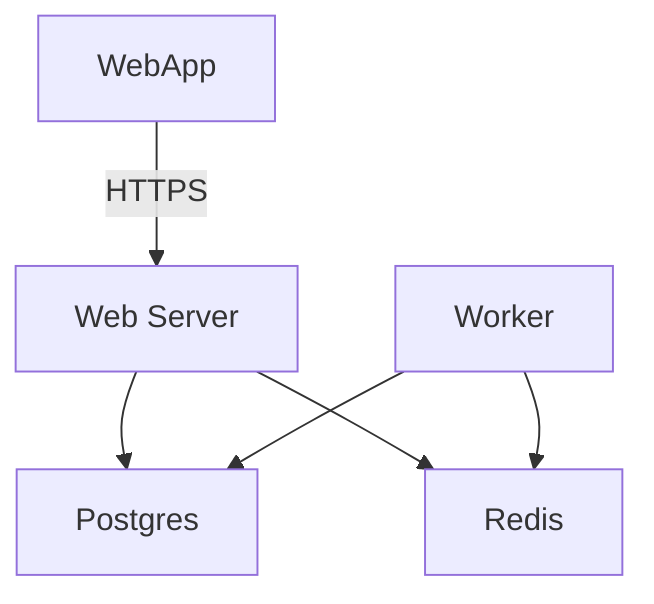

# Architecture

The architecture is best visualized with the diagram below.

```mermaid
graph TD;
    A[WebApp] -->|HTTPS| B[Web Server];
    B --> C[Postgres];
    B --> D[Redis];
    E[Worker] --> C;
    E --> D;
```

Where the worker handles long running tasks and backgound tasks.

